# Balkonboeman - camera recognition experiment

**Author:** Joep  
**Last checkpoint:** 3 October 2026  
**Scope:** Grove Vision AI V1 camera recognition experiment, supported by Arduino Uno.

## Current status

| Part | Evidence / status |
| --- | --- |
| Arduino Blink | User confirmed blinking built-in LED; video available |
| Existing camera model | User confirmed person detection and live camera view |
| Custom dataset | Downloaded: Crow + Pigeon, version 3 |
| Training | 30 epochs completed; model files reported present in Colab |
| Pigeon recognition | Not demonstrated successfully; final reported pigeon recall: 0 |
| Custom model on camera | Not yet deployed |
| Internet / API notification | Not yet integrated with this camera experiment |

This camera-only experiment does not yet demonstrate the assignment's external server/API connection. Keep intended product features separate from tested hardware behaviour. Merging classes into “bird” was proposed, but has not been implemented or evaluated.

## Contents

1. [Equipment and connections](#1-equipment-and-connections)
2. [Check the Arduino](#2-check-the-arduino)
3. [Run the camera example](#3-run-the-camera-example)
4. [Restore and inspect the live view](#4-restore-and-inspect-the-live-view)
5. [Prepare the dataset](#5-prepare-the-dataset)
6. [Train the custom model](#6-train-the-custom-model)
7. [Evaluate the experiment](#7-evaluate-the-experiment)
8. [Next experiments](#8-next-experiments)

## 1. Equipment and connections

**Goal:** The goal of this setup is to use a local AI model on the Grove Vision AI camera to detect pigeons on your balcony. The camera sends detection results to a microcontroller. In the intended system, a Wi-Fi-enabled NodeMCU uses the Telegram Bot API to send you a notification. You can then send a command to activate an actuator, such as a speaker or motor, intended to scare the pigeon away.
Reliable pigeon detection, API notifications and actuator control have not yet been demonstrated in this experiment.

- Arduino Uno R3; Grove Base Shield V2; Grove Vision AI Module V1.
- Grove cable; Uno USB cable; camera USB-C cable; laptop.
- Record your actual shield voltage setting and connection labels before publishing wiring instructions. A photo alone is not a complete pin diagram.

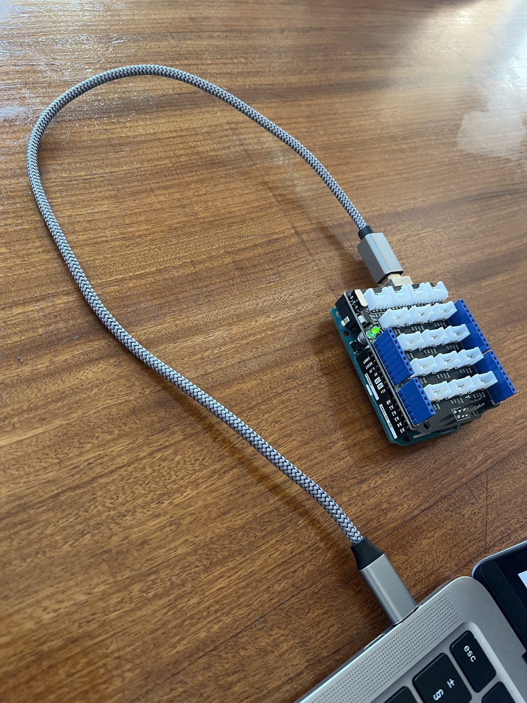
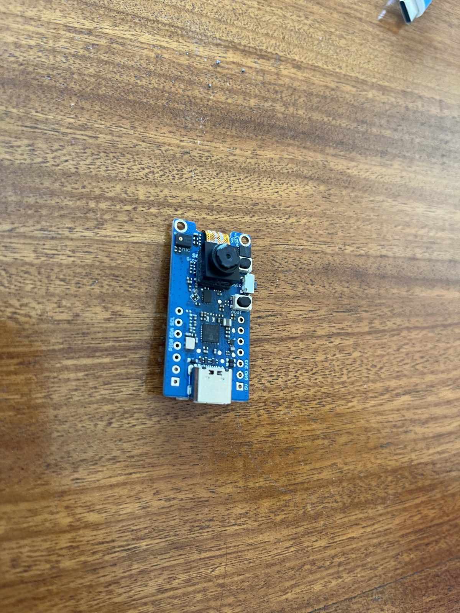
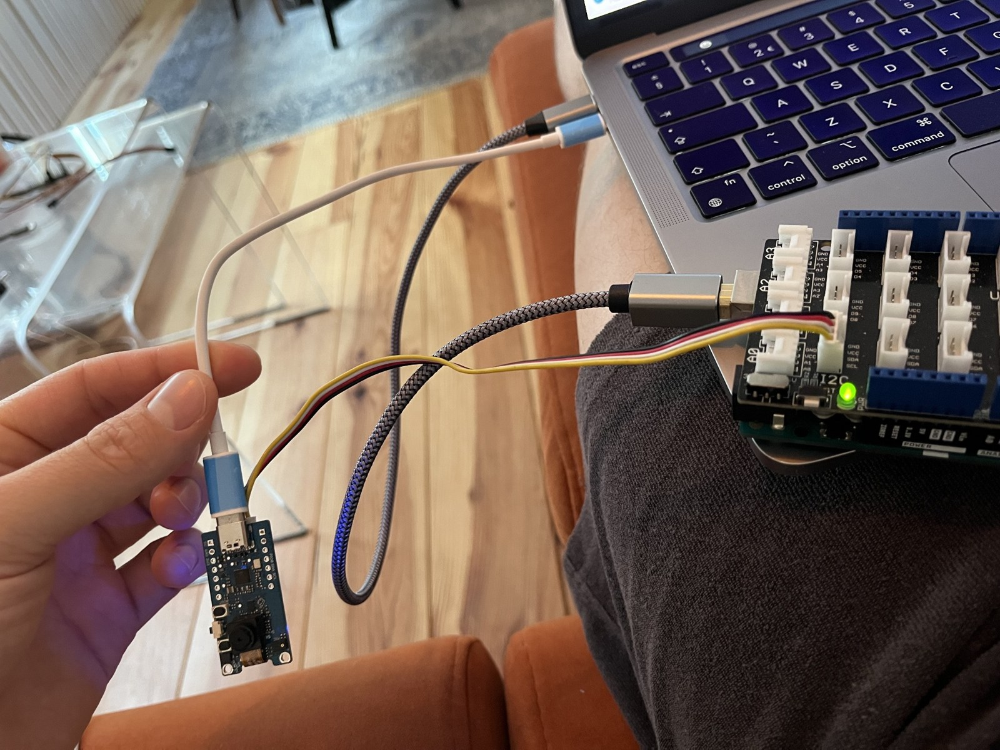

**Your instructions:** `[WRITE the checked connections, cable orientation and power arrangement.]`  
**Checkpoint:** `[WRITE how the reader verifies the connections before proceeding.]`

**Source:** [Seeed — Grove Vision AI Module V1](https://wiki.seeedstudio.com/Grove-Vision-AI-Module/).

## 2. Check the Arduino

**Goal:** `[WRITE why Blink is tested before adding the camera.]`

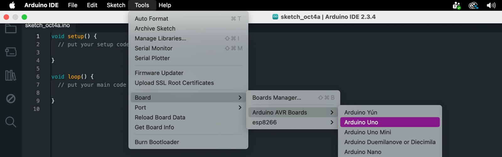
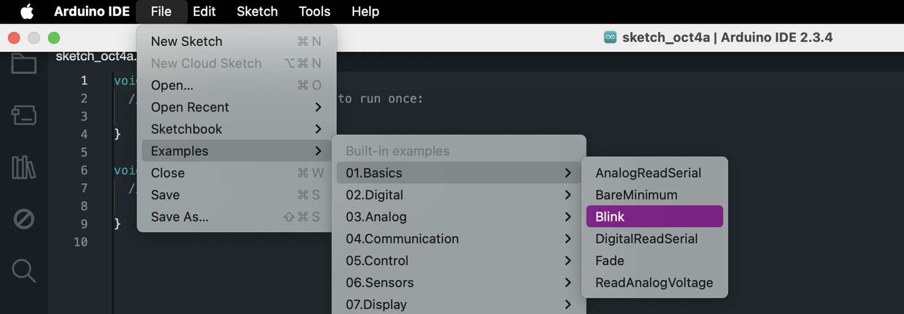

**Your instructions:** `[WRITE your actual board, port, example selection and upload procedure.]`  
**Checkpoint:** `[WRITE which LED blinks and which LED remains on.]`

[Download the recorded Blink test](evidence/blink-test.mov).

**Source:** [Arduino — Blink](https://docs.arduino.cc/built-in-examples/basics/Blink/).

## 3. Run the camera example

**Goal:** `[WRITE why the existing model is tested first.]`

**Your instructions:** `[WRITE the library installation, object_detection example, board selection and upload steps you performed.]`  
**Serial Monitor setting used:** 115200 baud.  
**Checkpoint:** `[WRITE the observed change between a person and the table, using your actual results.]`

**Sources:** [Seeed module documentation](https://wiki.seeedstudio.com/Grove-Vision-AI-Module/) · [Seeed Arduino GroveAI library](https://github.com/Seeed-Studio/Seeed_Arduino_GroveAI).

## 4. Restore and inspect the live view

**Goal:** `[WRITE what the browser view adds to the serial output.]`

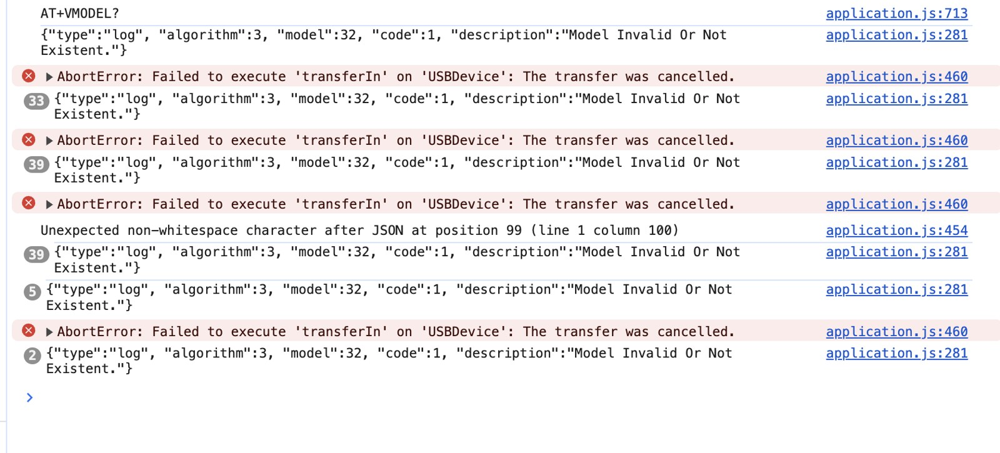
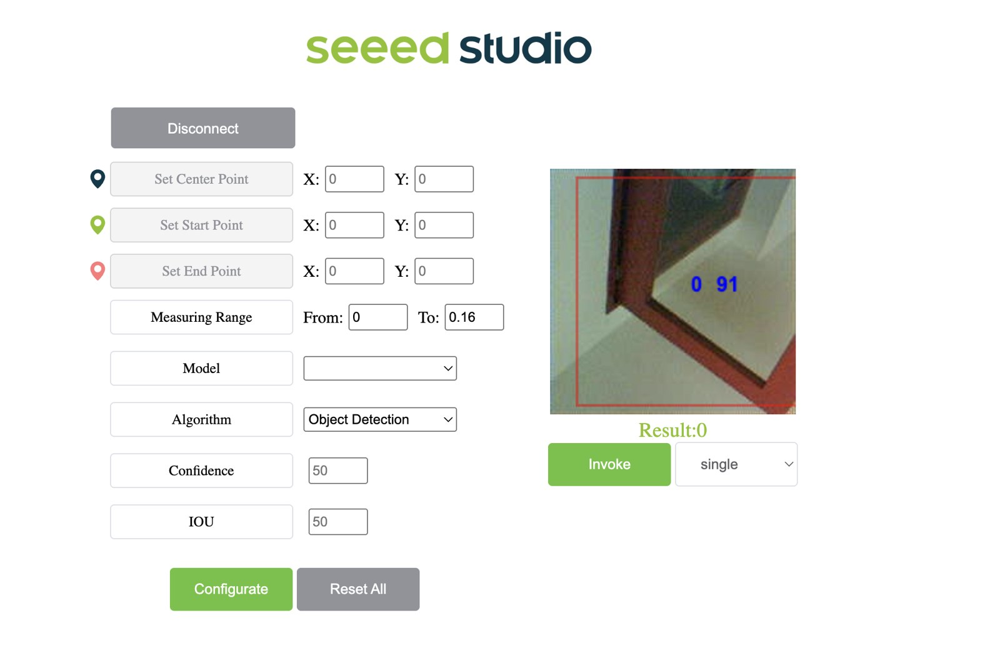

**Your instructions:** `[WRITE the browser connection process and recovery sequence you actually tested.]`  
**Problem and tested solutions:** `[WRITE the symptom, unsuccessful attempts and successful recovery. Do not claim a proven root cause.]`  
**Checkpoint:** `[WRITE how you verified a changing live image and detection.]`

**Sources:** [Seeed camera viewer](https://vision-ai-demo.seeed.cn/) · [Module documentation](https://wiki.seeedstudio.com/Grove-Vision-AI-Module/).

## 5. Prepare the dataset

**Goal:** `[WRITE why this dataset was chosen and what the two categories mean.]`

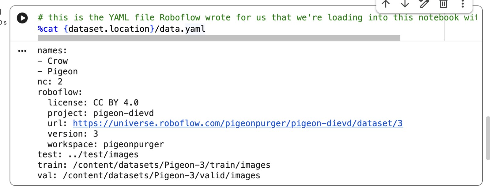

**Your instructions:** `[WRITE how you selected version 3, exported YOLOv5 PyTorch data and downloaded it into Colab. Never publish your API key.]`  
**Checkpoint:** `[WRITE the folder path and how you confirmed the class names.]`

**Dataset attribution:** PigeonPurger, *Pigeon*, version 3, [Roboflow dataset](https://universe.roboflow.com/pigeonpurger/pigeon-dievd/dataset/3), [CC BY 4.0](https://creativecommons.org/licenses/by/4.0/). The included dataset screenshots display boxes and labels from this dataset; they are not model predictions. Images were resized for documentation.

## 6. Train the custom model

**Goal:** `[WRITE what the experiment trains and what a completed training run does not prove.]`

**Recorded setup:** Colab runtime version 2025.07; Python 3.11; Tesla T4; PyTorch 2.6.0; NumPy 1.26.4. Repository: Seeed yolov5-swift. Starting weights: yolov5n6-xiao.pt. Image size: 192; batch size: 64; epochs: 30.

**Your instructions:** `[WRITE the actual sequence, including the dependency adjustments. These settings alone are not a reproducible installation guide.]`

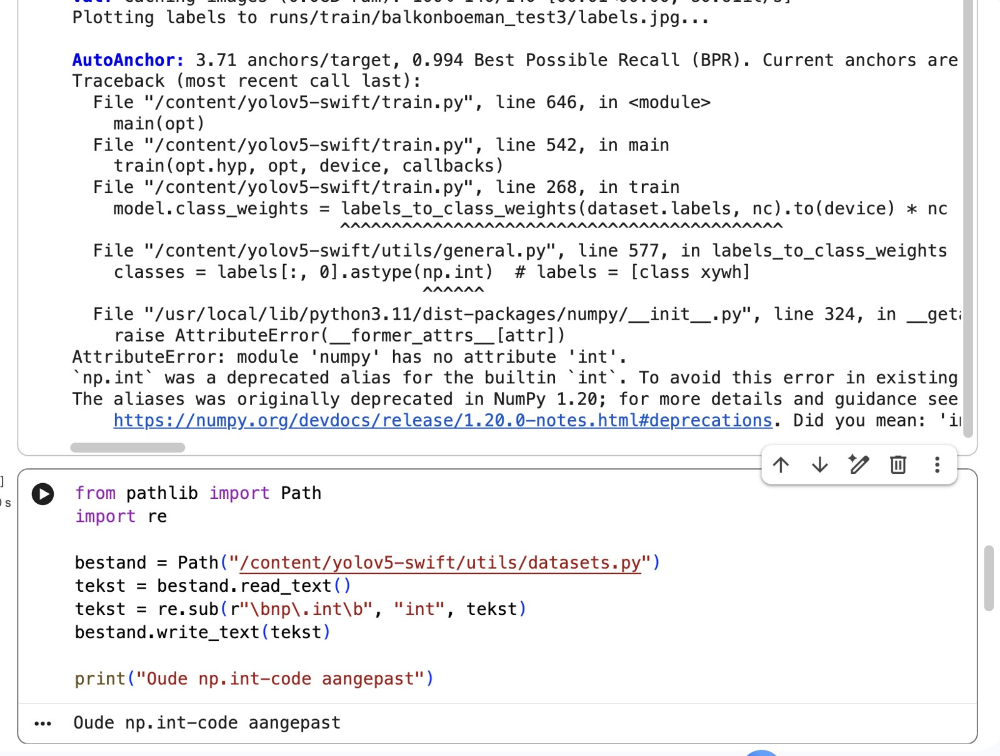
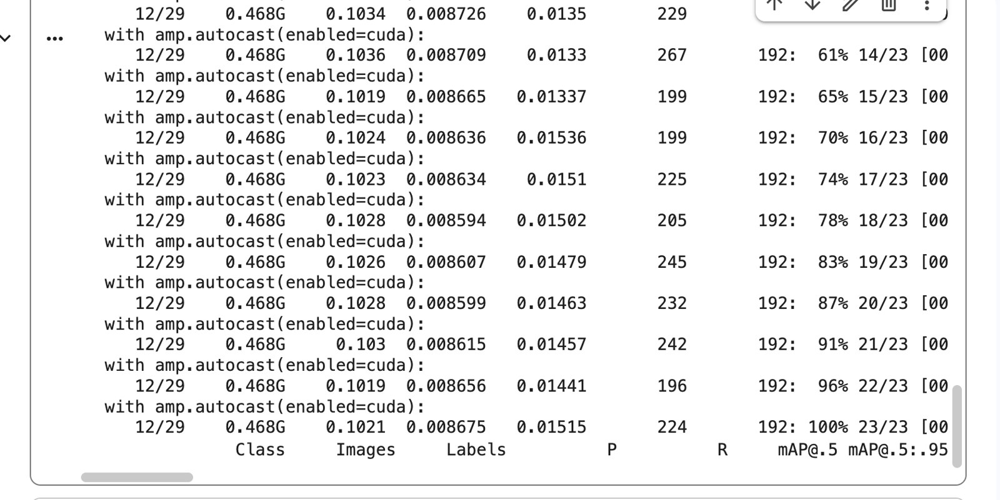

**Troubleshooting:** `[WRITE your explanations using the evidence notes: TensorFlow dependency, PyTorch weights loading, NumPy aliases and Pillow plotting.]`  
**Checkpoint:** `[WRITE how you verified 30 epochs and checked that best.pt, last.pt and results.csv existed.]`

**Recorded output directory:** `runs/train/balkonboeman_test4` — yours may differ after another run. The actual model files are still in Colab and are NOT included in this package. Download them before ending the session.

**Sources:** [Seeed training and deployment guide](https://wiki.seeedstudio.com/Train-Deploy-AI-Model-Grove-Vision-AI/) · [yolov5-swift](https://github.com/Seeed-Studio/yolov5-swift) · [Seeed starting weights](https://github.com/Seeed-Studio/yolov5-swift/releases/download/v0.1.0-alpha/yolov5n6-xiao.pt) · [PyTorch serialization](https://docs.pytorch.org/docs/stable/notes/serialization.html) · [NumPy alias deprecation](https://numpy.org/doc/stable/release/1.20.0-notes.html#deprecations) · [Pillow removed APIs](https://pillow.readthedocs.io/en/stable/deprecations.html#font-size-and-offset-methods).

## 7. Evaluate the experiment

**Goal:** `[WRITE why evaluation is needed before deployment.]`

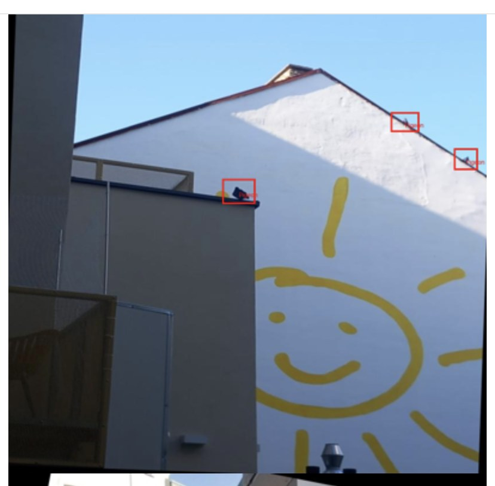
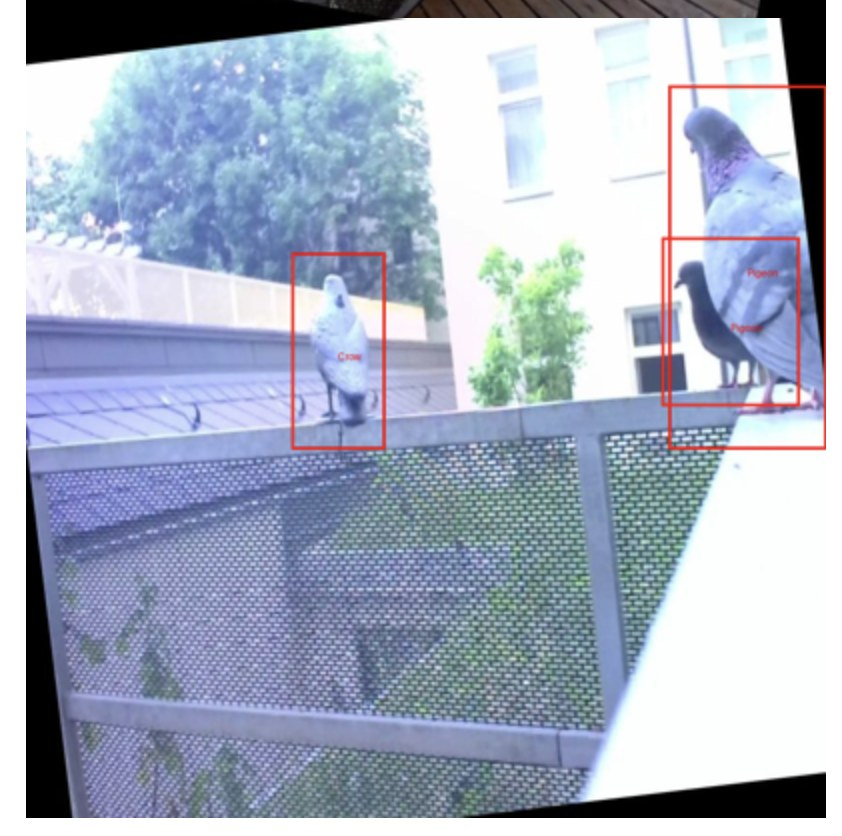

**Your evaluation:** `[WRITE your interpretation of low scores and the suspected label error. Three sample images do not establish the quality of the whole dataset.]`

- Reported final validation output: 140 images; 323 labels; overall recall approximately 0.146; mAP@0.5 approximately 0.0702.
- Pigeon recall reported as 0. A precision value of 1 alongside recall 0 is not evidence of successful pigeon detection.
- A suspect label was found by displaying dataset annotations. This is a possible contributing factor, not a proven explanation for all poor performance.
- The last CSV row reported overall mAP@0.5 = 0.069359. This may differ from the final saved-model evaluation; preserve both with their context.

**Checkpoint:** `[WRITE what your results justify and what they do not.]`

## 8. Next experiments

- [ ] Save model files and results outside the temporary Colab runtime.
- [ ] Decide whether to correct pigeon labels or test one combined bird class.
- [ ] Train and compare on held-out images; record misses and false detections.
- [ ] Resolve conversion compatibility and attempt camera deployment.
- [ ] Read the custom detection result on the microcontroller.
- [ ] Test the required external server/API connection; document the actual architecture.
- [ ] Ask another reader to follow the instructions and record confusing steps.

`[WRITE the limitations and next steps in your own words.]`

## Evidence and authorship

See [Dutch working notes](WERKNOTITIES_NL.md) for the factual experiment record and [raw first failure output](evidence/training-error-initial.md). These are preparation materials, not a completed student-authored manual. Remove private data before publishing. Remove placeholders only after replacing them with your verified explanations. Disclose AI translation or organisational assistance accurately.
